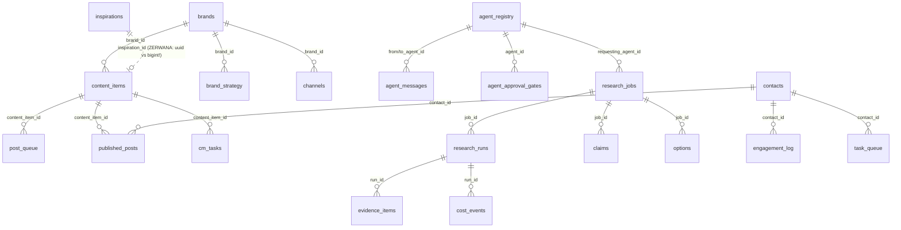

# Audyt bazy danych ags_crd - stan faktyczny (04/07/2026)

Zrodlo: read-only zrzut information_schema + pg_stat z serwera (temp webhook). **Zasada kanoniczna (Tomasz 04/07):
baza = najwyzszy priorytet; dobrze zbudowane relacje = zero duplikacji + dowolny interfejs (Telegram/web/mobile/Slack)
czyta te same, aktualne dane.**

## 1. Stan: 32 tabele, 18 relacji FK, ~1.2k wierszy

### Diagram relacji (grupy domenowe)

Tabele bez FK (samodzielne z natury): app_secrets (sejf), brand_config (+historia), user_agent_state,
processed_updates, hitl_sessions, conversation_state (stan n8n), voice_notes, voice_samples,
subagent_daily/weekly_reports, agent_logs (agent_id = string 'brand:channel' - swiadome, patrz 3.4).

## 2. Mocne strony (uczciwie)
- **Rdzen CM w pelni relacyjny:** brands -> content_items -> post_queue / published_posts / cm_tasks.
  Jeden material = jeden wiersz content_items, warianty i publikacje POKAZUJA na niego (zero kopiowania tresci
  jako zrodla prawdy; content w post_queue to WARIANT per kanal, nie duplikat).
- **Siec agentowa relacyjna:** agent_registry jest kotwica dla messages/gates/research_jobs.
- **Researcher wzorcowy:** jobs -> runs -> evidence/cost, jobs -> claims/options. Pelny lancuch audytu kosztow.
- **CRM "Marty" ISTNIEJE jako schemat (31/05):** `contacts` (40 pol: narracja, icp_tier, pain_points,
  next_action+due+owner, handles jsonb per platforma, intent_signals) + `engagement_log` (contact_id FK,
  action_type, channel, agent, content, response, platform_id, metrics jsonb) + `task_queue.contact_id`
  (follow-upy) + `published_posts.contact_id`. DOKLADNIE model "Marta zareagowala na post X komentarzem Y".
  Stan: 0 wierszy - warstwa danych gotowa, czeka na agentow (Blueprint: Opiekun Relacji + Sprzedawca; intake: Sekretarka).

## 3. Slabosci znalezione (kandydaci do naprawy)
1. **ZERWANA relacja schowek -> produkcja:** `content_items.inspiration_id` jest UUID, a `inspirations.id`
   to BIGINT. Typy sie nie zgadzaja = FK niemozliwy, link nigdy nie zadziala. (Dzis kolumna pusta - naprawa tania.)
2. **brand/platform jako luzny TEKST** w post_queue i published_posts (bez FK do brands/channels) - dokladnie
   ryzyko "tabel bez relacji": literowka tworzy osieroconego wiersza. Naprawa: FK `NOT VALID` (pilnuje NOWYCH
   zapisow, stare dane bez blokady) + walidacja po sprzataniu.
3. **contacts ma ZDUBLOWANE kolumny** (slad sklejenia dwoch projektow 31/05): name/full_name,
   pain_point/pain_points, icp_tier/tier, geography/geo_tier, last_interaction_date/last_interaction.
   Do konsolidacji PRZED pierwszym agentem CRM (decyzja: ktora wersja kanoniczna; dzis 0 wierszy = tanio).
4. agent_logs.agent_id = string 'brand:channel' zamiast FK - swiadomy kompromis (cel moze nie miec agenta
   w registry); do rewizji gdy subagenci dostana wpisy w agent_registry per cel.
5. hitl_sessions / conversation_state (n8n, 97 wierszy) - legacy stany bez relacji; zostaja do wygaszenia
   starego X-agenta.

## 4. Retencja, archiwizacja, KOPIE BEZPIECZENSTWA (dzis: BRAK backupu = najwyzsze ryzyko)
Stan: rosna evidence_items (699), agent_messages (45), hitl_sessions (97); processed_updates ma czyszczenie
w kodzie (>24h); n8n executions rosna po stronie n8n.
**Propozycja (do zatwierdzenia, wdrozenie = 1 cron na Mikrusie + 1 decyzja):**
- **Backup dzienny:** cron 03:30 `pg_dump -Fc ags_crd` -> /root/backups, rotacja 7 dni + kopia tygodniowa
  poza serwer (rclone do dowolnego storage / lokalny download). Bez tego jeden padniety dysk = utrata WSZYSTKIEGO.
- **Retencja:** evidence_items/claims starsze niz 90 dni -> archiwum (osobna tabela _archive albo zostawic -
  to material dowodowy researchu, tanio go trzymac); agent_messages status=read >30 dni -> czyszczenie;
  n8n: EXECUTIONS_DATA_MAX_AGE=168h w env kontenera (wymaga docker run z env - przy nastepnym odtworzeniu n8n).
- **Zasada:** ZADNA tabela biznesowa nie jest czyszczona bez decyzji Tomasza; czyszczenie dotyczy tylko
  logow technicznych.

## 5. Pakiet naprawczy db/008 (przygotowany, NIE wykonany - decyzja Tomasza)
`cm-agent/db/008_relations_fix.sql`: naprawa typu inspiration_id + FK (pkt 1), FK NOT VALID dla
post_queue/published_posts -> brands/channels (pkt 2). Konsolidacja contacts = OSOBNA decyzja (pkt 3) przy
projekcie warstwy CRM (Brama 1 dla Opiekuna Relacji).

## 6. Co to daje przy sprzedazy (argument dla klienta)
Jedno zrodlo prawdy: kazda publikacja, kazdy kontakt, kazda decyzja agenta i kazdy wydany dolar to wiersz
w relacyjnej bazie. Zmiana w jednym miejscu = wszyscy widza aktualne dane. Interfejs (Telegram dzis, web/mobile
jutro) to tylko okienko na te same tabele. Do tego pelny slad audytu (kto zdecydowal, ile kosztowalo, skad teza).
